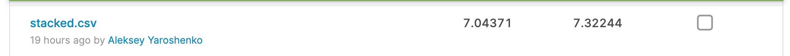

## Соревнование Thousand Facial Landmarks по курсу Computer Vision в MADE (data.mail.ru)
Студент: Алексей Ярошенко

**Что сработало:**
- Т.к. модели обучены на imagenet, взял нормировочные константы оттуда.
-  Увеличил CROP_SIZE до 224, как в imagenet. К тому же, подумал, что чем выше разрешение, тем можно точнее попасть в нужный пиксель.
- Увеличил размер трейна с 80 до 97%. Для адекватной валидации хватало 3% (11 000+ картинок), датасет  относительно большой.
- Модели учились чутка нестабильно, по разному. Долго с этим возился. В конце концов, пришел к тому, что использовал sсheduler CosineAnnealingWarmRestarts, чтобы менять lr по синусоиде от максимума до нуля, каждый раз удваивая период после рестарта. С ним модели начали лучше и стабильнее сходиться. В статьях пишут, что с ним больше вероятность найти лучший локальный минимум. У меня работал лучше чем ReduceLROnPlateau.
- Учил модели адамом, дообучал на SGD. Прочел где-то, попробовал так делать, и иногда получалось небольшое повышение метрики выжать. Хотя возможно, с SGD сеть медленнее училась и на маленьком размере батча просто не успевала переобучиться.
- Делал рестарты. Т.е. если видел, что модель не сходится/переобучается и откатывался к последнему чекпойнту и менял что-то: оптимайзер, LR, перезапускал scheduler.
- Добавил регуляризацию. Небольшой weight_decay делал модель устойчивее на самых последних этапах, когда сеточка начинает переобучаться. Скор на валидации от этого не рос, но на паблике это было в плюс.
- Протестировал много предобученных моделей из torchvision. Лучше всего зашли densenet
- Я понадеялся, что ошибки хотя бы на некоторых точках нормально распределены и если я наставлю несколько точек на плоскости, то центр будет лучше предсказывать точку. Скачал топ своих лучших сабмитов для разных архитектур/моделей, усреднил предсказания. К тому же, скорее всего, это сделало модель стабильнее и дало еще небольшой буст после конца соревнования, когда открылся private leaderboard. На паблике я за 2 часа до конца стал вторым, на привате снова выкинуло на 1-е место.
- Усреднил топ сабмитов со взвешиванием: у лучшего скора больший вес.
- Логировал результат трейна и теста каждой эпохи в телеграм, чтобы, если, к примеру случайно проснулся ночью, можно при необходимости сделать рестарт обучения с новыми параметрами. Из кода убрал, ибо он особого смысла не несет.

**Что не помогло:**
- Замораживать слои. Дообучать разные слои с разным lr. Дообучать по очереди. Быстрее становилось, лучше - нет. Нужно, к тому же, за этим следить.
- Подмешивать какой-то еще лосс (к примеру smooth_l1_loss). Наверное, это логично, ибо не представляю, что может быть лучше оптимизации MSE, когда у нас целевая метрика - MSE. Только если как своеобразный регуляризатор, наверное.
- Простые аугментации вроде контраста, насыщенности и т.д. К тому же, данных достаточно, а если накинуть пару аугментаций, все совсем долго считается.
- Поднимать разрешение выше 224. Больших картинок не очень много, а учится сеть неприлично дольше. Батчи становятся все меньше, ибо памяти не хватает. Возможно, и дало бы скор лучше, но я бы его просто не дождался.

**Чего не делал:**
- Не очень удобных в написании аугментаций. К примеру, с поворотом. 
- Не чистил выбросы. Наверное, стоило бы. Но я подумал, что раз выбросы есть и в тесте, и трейне, пускай модель хоть что-то из них выучит. Но тут без понятия.
- Не использовал сторонних библиотек и архитектур кроме torchvision.models.

